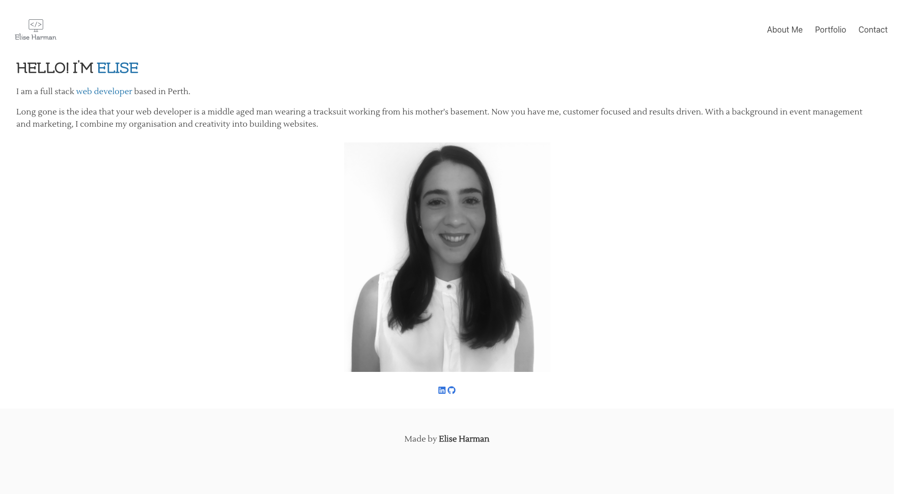
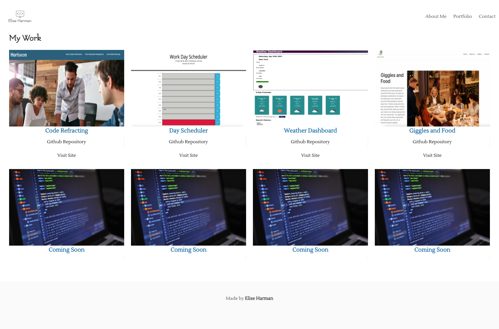
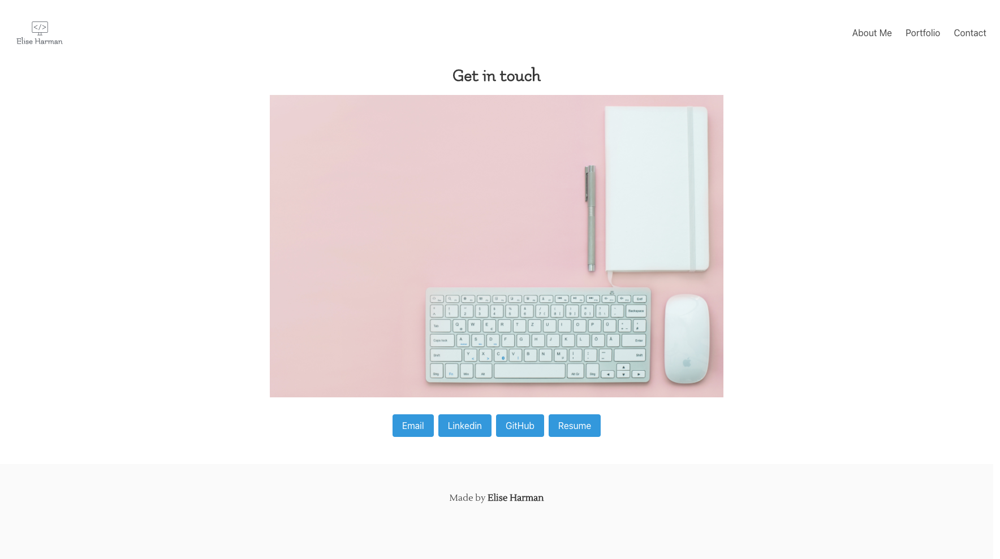

# 02 Advanced CSS Professional Portfolio Homework Assignment
## Description

For this project I created a web application in the form of a portfolio from scratch. 

The web application displays my work which can be viewed once clicked on. 

## Usage
 

[Link to deployed application](https://harmane4.github.io/portfolio/)

## Technologies Used 

- HTML 
- CSS
- Bulma 

## License 
[MIT](https://choosealicense.com/licenses/mit/)

