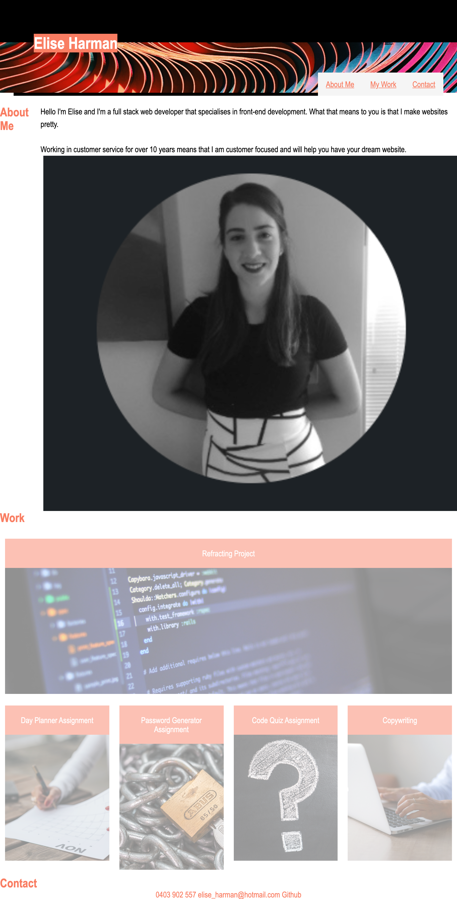

# 02 Advanced CSS Professional Portfolio Homework Assignment
## Description

For this project I created a web application in the form of a portfolio from scratch. 

The web application displays my work which can be viewed once clicked on. As I am still building my portfolio, only one link, the refracting project is active. 

Problems that were solved was making the webpage responsive 

## Usage
 

[Link to deployed application](https://github.com/harmane4/portfolio)

## Credits
Images used as place holder images:

[Code computer image](https://www.pexels.com/photo/black-and-gray-laptop-computer-546819/)

[Woman on computer](https://www.pexels.com/photo/crop-lady-surfing-information-for-work-on-modern-computer-5325056/)

[Woman writing on calander](https://www.pexels.com/photo/crop-lady-surfing-information-for-work-on-modern-computer-5325056/)

[Question Mark Image](https://www.pexels.com/photo/question-mark-illustration-356079/)

[Lock Image](https://www.pexels.com/photo/strong-lock-locked-padlock-39624/)

[Hero Image](https://unsplash.com/photos/5Ui5glVjUAQ)

Websites used to create application: 

 
[Horizontal nav bar](https://www.w3schools.com/css/css_navbar_horizontal.asp)

[Flex Box](https://css-tricks.com/snippets/css/a-guide-to-flexbox/)

[Hover](https://www.w3schools.com/cssref/sel_hover.asp)

## License 
[MIT](https://choosealicense.com/licenses/mit/)

